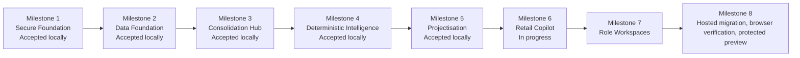

# Phase 0 Delivery Progress

```mermaid
flowchart LR
  A["Milestone 1<br/>Secure Foundation<br/>Accepted locally"] --> B["Milestone 2<br/>Data Foundation<br/>Accepted locally"]
  B --> C["Milestone 3<br/>Consolidation Hub<br/>Accepted locally"]
  C --> D["Milestone 4<br/>Deterministic Intelligence<br/>Accepted locally"]
  D --> E["Milestone 5<br/>Projectisation<br/>Accepted locally"]
  E --> F["Milestone 6<br/>Retail Copilot<br/>In progress"]
  F --> G["Milestone 7<br/>Role Workspaces"]
  G --> H["Milestone 8<br/>Hosted migration, browser verification, protected preview"]
```

The active implementation switch remains `reports/CURRENT_STATE.md`. A local
gate does not imply hosted Supabase or Vercel acceptance.
